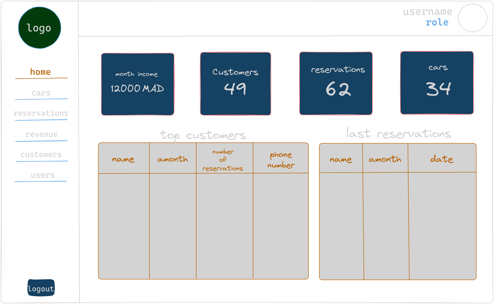

# CMS Desktop App

## Overview

Welcome to CMS, a desktop application designed to streamline cars management system.

## Technologies Used

```r
├── README.md
├── app
│   ├── __init__.py
│   ├── __pycache__
│   │   └── __init__.cpython-310.pyc
│   ├── core
│   │   ├── Data_Handler
│   │   │   ├── GetHomeData.py
│   │   │   ├── __init__.py
│   │   │   ├── __pycache__
│   │   │   │   ├── GetHomeData.cpython-310.pyc
│   │   │   │   └── __init__.cpython-310.pyc
│   │   │   ├── car.py
│   │   │   ├── customer.py
│   │   │   └── user.py
│   │   ├── __init__.py
│   │   ├── __pycache__
│   │   │   ├── __init__.cpython-310.pyc
│   │   │   └── authentication.cpython-310.pyc
│   │   ├── authentication.py
│   │   ├── business_logic.py
│   │   ├── data_handler.py
│   │   └── image_handler.py
│   └── view
│       ├── __init__.py
│       ├── __pycache__
│       │   ├── __init__.cpython-310.pyc
│       │   ├── app.cpython-310.pyc
│       │   ├── dashboard_frame.cpython-310.pyc
│       │   ├── global_style.cpython-310.pyc
│       │   └── login_frame.cpython-310.pyc
│       ├── app.py
│       ├── dashboard
│       │   ├── __init__.py
│       │   ├── __pycache__
│       │   │   ├── __init__.cpython-310.pyc
│       │   │   ├── header.cpython-310.pyc
│       │   │   ├── main.cpython-310.pyc
│       │   │   └── sidebar.cpython-310.pyc
│       │   ├── header.py
│       │   ├── main.py
│       │   ├── sections
│       │   │   ├── __init__.py
│       │   │   ├── __pycache__
│       │   │   │   └── __init__.cpython-310.pyc
│       │   │   ├── cars
│       │   │   │   ├── __init__.py
│       │   │   │   ├── __pycache__
│       │   │   │   │   ├── __init__.cpython-310.pyc
│       │   │   │   │   ├── cars_section.cpython-310.pyc
│       │   │   │   │   └── main.cpython-310.pyc
│       │   │   │   ├── components
│       │   │   │   │   └── __init__.py
│       │   │   │   └── main.py
│       │   │   ├── customers
│       │   │   │   ├── __init__.py
│       │   │   │   ├── __pycache__
│       │   │   │   │   ├── __init__.cpython-310.pyc
│       │   │   │   │   ├── customers_section.cpython-310.pyc
│       │   │   │   │   └── main.cpython-310.pyc
│       │   │   │   ├── components
│       │   │   │   │   └── __init__.py
│       │   │   │   └── main.py
│       │   │   ├── home
│       │   │   │   ├── __init__.py
│       │   │   │   ├── __pycache__
│       │   │   │   │   ├── __init__.cpython-310.pyc
│       │   │   │   │   ├── home.cpython-310.pyc
│       │   │   │   │   └── main.cpython-310.pyc
│       │   │   │   ├── components
│       │   │   │   │   └── __init__.py
│       │   │   │   └── main.py
│       │   │   ├── reservations
│       │   │   │   ├── __init__.py
│       │   │   │   ├── __pycache__
│       │   │   │   │   ├── __init__.cpython-310.pyc
│       │   │   │   │   ├── main.cpython-310.pyc
│       │   │   │   │   └── reservation_section.cpython-310.pyc
│       │   │   │   ├── components
│       │   │   │   │   └── __init__.py
│       │   │   │   └── main.py
│       │   │   ├── revenues
│       │   │   │   ├── __init__.py
│       │   │   │   ├── __pycache__
│       │   │   │   │   ├── __init__.cpython-310.pyc
│       │   │   │   │   ├── main.cpython-310.pyc
│       │   │   │   │   └── revenues_section.cpython-310.pyc
│       │   │   │   ├── components
│       │   │   │   │   └── __init__.py
│       │   │   │   └── main.py
│       │   │   └── users
│       │   │       ├── __init__.py
│       │   │       ├── __pycache__
│       │   │       │   ├── __init__.cpython-310.pyc
│       │   │       │   ├── main.cpython-310.pyc
│       │   │       │   └── users_section.cpython-310.pyc
│       │   │       ├── components
│       │   │       │   └── __init__.py
│       │   │       └── main.py
│       │   └── sidebar.py
│       ├── dashboard_frame.py
│       ├── global_style.py
│       ├── libraries
│       │   ├── __pycache__
│       │   │   └── professionalCTk.cpython-310.pyc
│       │   └── professionalCTk.py
│       └── login_frame.py
├── env
│   ├── database
│   │   └── dbenv.sql
│   └── python
│       └── python.sh
├── main.py
├── models
│   ├── __init__.py
│   ├── __pycache__
│   │   ├── __init__.cpython-310.pyc
│   │   ├── base_model.cpython-310.pyc
│   │   ├── car.cpython-310.pyc
│   │   ├── customer.cpython-310.pyc
│   │   ├── reservation.cpython-310.pyc
│   │   ├── revenue.cpython-310.pyc
│   │   ├── settings.cpython-310.pyc
│   │   └── user.cpython-310.pyc
│   ├── base_model.py
│   ├── car.py
│   ├── customer.py
│   ├── engine
│   │   ├── __init__.py
│   │   ├── __pycache__
│   │   │   ├── __init__.cpython-310.pyc
│   │   │   └── db_storage.cpython-310.pyc
│   │   └── db_storage.py
│   ├── reservation.py
│   ├── revenue.py
│   ├── settings.py
│   └── user.py
├── requirements.txt
├── resources
│   ├── gifs
│   │   ├── darkload.gif
│   │   └── load.gif
│   ├── icons
│   │   ├── CMSlogo.png
│   │   ├── Error.png
│   │   ├── Success.png
│   │   ├── cars.png
│   │   ├── customers.png
│   │   ├── dark-mode.png
│   │   ├── income.png
│   │   ├── light-mode.png
│   │   ├── loading.png
│   │   ├── reservations.png
│   │   └── sidebar
│   │       ├── cars.png
│   │       ├── customers.png
│   │       ├── home.png
│   │       ├── logout.png
│   │       ├── reservations.png
│   │       ├── revenues.png
│   │       └── users.png
│   ├── images
│   │   ├── Error.svg
│   │   ├── Graph_ORM.png
│   │   ├── Success.svg
│   │   ├── dashboard_frame.png
│   │   ├── home.jpg
│   │   └── homedark.jpg
│   └── styles
│       └── styles.css
├── test
│   ├── about.txt
│   ├── test.py
│   └── testbaseModel.py
└── tmp
    ├── graphs.py
    └── shadow.py

```
### Database: PostgreSQL

Our app relies on PostgreSQL as the primary database. PostgreSQL is a powerful, open-source relational database management system known for its reliability and extensibility. It provides robust support for complex queries, transactions, and data integrity.

### Backend: SQLAlchemy and Python OOP

#### SQLAlchemy

We leverage SQLAlchemy as the Object-Relational Mapping (ORM) tool for interacting with the PostgreSQL database. SQLAlchemy simplifies database operations by allowing developers to interact with the database using Python classes and objects.

##### Tables


#### Python OOP

The backend of CMS is built using Python, utilizing Object-Oriented Programming (OOP) principles. This design approach enhances code organization, modularity, and maintainability. Python's versatility and readability contribute to an efficient and scalable backend.

### GUI: CustomTkinter

Our Graphical User Interface (GUI) is crafted using CustomTkinter, a customized version of the Tkinter library in Python. CustomTkinter enhances the user experience by providing a tailored interface with intuitive navigation and a visually appealing design. It streamlines user interactions and ensures a seamless experience while interacting with the CMS desktop app.

### UI:

#### Dashboar:


##### home (light):


##### home (dark):


## Features

### PostgreSQL Database Features

- **Reliability:** PostgreSQL ensures data integrity and reliability, making it a suitable choice for managing critical information.
- **Scalability:** The database scales effortlessly to accommodate growing data volumes and complex queries.
- **Flexibility:** PostgreSQL supports a wide range of data types and allows for the implementation of custom functions, providing flexibility in data modeling.

### SQLAlchemy and Python OOP Backend Features

- **Modularity:** The use of SQLAlchemy and Python OOP promotes code modularity, making it easy to maintain and extend the backend functionality.
- **Security:** Our backend implementation follows best practices to ensure data security and prevent unauthorized access.
- **Transaction Support:** SQLAlchemy facilitates robust transaction management, ensuring data consistency and reliability.

### CustomTkinter GUI Features

- **Intuitive Design:** CustomTkinter provides a user-friendly interface with a focus on intuitive design, enhancing user experience and navigation.
- **Customization:** The GUI is highly customizable, allowing for branding and tailoring the interface to meet specific user preferences.
- **Responsive Layouts:** CustomTkinter ensures responsive layouts that adapt to different screen sizes, providing a consistent experience across devices.

## Getting Started

[Provide instructions on how to install and run the CMS desktop app. Include any dependencies or prerequisites.]

## License

This project is licensed under the [MIT License](LICENSE.md) - see the [LICENSE.md](LICENSE.md) file for details.

## Acknowledgments

- [List any contributors or external libraries/tools used in the project.]
